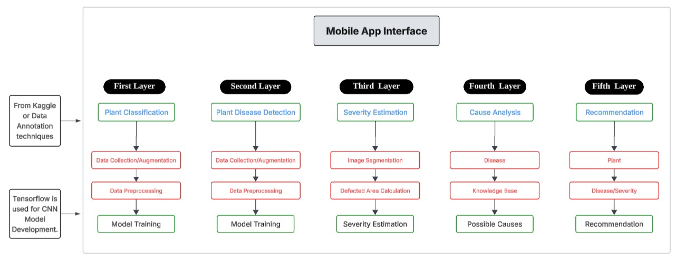

# 🌿 Mari Fasal — Smart Agriculture Assistant

> AI-powered plant disease detection and severity estimation system built for Pakistani farmers.

---

## 📊 System Workflow



---

## 📖 Overview

**Mari Fasal** (meaning *My Crop* in Urdu) is an end-to-end smart agriculture assistant that helps farmers identify plant diseases and estimate their severity using AI. A farmer simply takes a photo of a plant leaf using the mobile app, and the system returns:

- ✅ The **disease name** (from 38 classes across 14 crop types)
- 📊 The **confidence score** of the prediction
- 🔴 The **disease severity percentage** (how much of the plant area is affected)
- 💊 **Causes & treatment recommendations** tailored for Pakistan's agricultural context

The system combines a **React Native (Expo) mobile app**, a **FastAPI backend**, and two deep learning models working in tandem.

---

## 🤖 AI Models

### 1. Disease Classification — TFLite Model
| Property | Detail |
|---|---|
| **Type** | MobileNet-based CNN (TensorFlow Lite) |
| **Input** | 128×128 RGB image |
| **Output** | 38-class softmax probabilities |
| **Format** | `.tflite` (optimized for mobile/edge) |
| **Size** | ~42 MB |

**Supported Crops & Diseases (38 classes):**

| Crop | Diseases |
|---|---|
| 🍎 Apple | Apple Scab, Black Rot, Cedar Apple Rust, Healthy |
| 🫐 Blueberry | Healthy |
| 🍒 Cherry | Powdery Mildew, Healthy |
| 🌽 Corn (Maize) | Cercospora Leaf Spot, Common Rust, Northern Leaf Blight, Healthy |
| 🍇 Grape | Black Rot, Esca (Black Measles), Leaf Blight, Healthy |
| 🍊 Orange | Huanglongbing (Citrus Greening) |
| 🍑 Peach | Bacterial Spot, Healthy |
| 🫑 Bell Pepper | Bacterial Spot, Healthy |
| 🥔 Potato | Early Blight, Late Blight, Healthy |
| 🍓 Strawberry | Leaf Scorch, Healthy |
| 🍅 Tomato | Bacterial Spot, Early Blight, Late Blight, Leaf Mold, Septoria Leaf Spot, Spider Mites, Target Spot, Yellow Leaf Curl Virus, Mosaic Virus, Healthy |
| 🫘 Soybean | Healthy |
| 🍓 Raspberry | Healthy |
| 🥒 Squash | Powdery Mildew |

---

### 2. Disease Severity Estimation — U-Net Segmentation Model
| Property | Detail |
|---|---|
| **Architecture** | U-Net with ResNet-34 encoder (`segmentation-models-pytorch`) |
| **Input** | Full-resolution plant image |
| **Output** | Pixel-wise disease mask |
| **Format** | `.pth` PyTorch checkpoint |
| **Size** | ~98 MB (download separately — see below) |

**How severity is calculated:**
1. A **plant mask** is extracted using HSV color thresholding (isolates green plant pixels from background)
2. The **U-Net model** predicts a disease mask (diseased vs. healthy pixels)
3. Disease predictions outside the plant area are discarded (avoids background misclassification)
4. `Severity % = (disease pixels / total plant pixels) × 100`

---

## 📱 Mobile App (Mari-Fasal)

Built with **React Native + Expo** (v57), supporting Android, iOS, and Web.

- 📷 Pick a photo from gallery or capture with camera (`expo-image-picker`)
- 📤 Uploads image to the FastAPI backend concurrently for both disease and severity predictions (`Promise.all`)
- 🃏 Displays results in a clean `ResultCard` component
- 🔗 File-based routing via `expo-router`


## 🗄️ Knowledge Base & Database

Disease causes and treatment recommendations are stored in CSV files (Pakistan-specific agricultural context) and converted into a structured **SQLite database** with the following schema:

---

## ⚙️ Setup & Installation

### Prerequisites
- Python 3.9+
- Node.js 18+
- CUDA-compatible GPU *(optional — CPU fallback supported)*

---

### 1. Clone the Repository

```bash
git clone https://github.com/M-Abdullah-Jutt/Mari-Fasal.git
cd Mari-Fasal
```

---

### 2. Backend Setup

```bash
# Create and activate virtual environment
python -m venv venv
venv\Scripts\activate        # Windows
# source venv/bin/activate   # macOS/Linux

# Install dependencies
pip install fastapi uvicorn pillow numpy tensorflow torch torchvision opencv-python segmentation-models-pytorch
```

> ⚠️ **Note:** The PyTorch segmentation model (`plantseg_unet_disease.pth`, ~98 MB) is not included in this repo due to GitHub file size limits. Place it at:
> ```
> Models/Plant_Segmentation/v1/plantseg_unet_disease.pth
> ```

**Start the API server:**

```bash
python api/main.py
```

---

### 3. Mobile App Setup

```bash
cd Mari-Fasal

# Install dependencies
npm install

# Update the API base URL to your computer's local IP
# Edit: Mari-Fasal/src/api/config.ts
# Change BASE_URL to: "http://<YOUR_LOCAL_IP>:8000"

# Start the Expo dev server
npx expo start
```

Then scan the QR code with **Expo Go** (Android/iOS) or press `a` for Android emulator / `i` for iOS simulator.

---

### 4. Build the Knowledge Base (optional)

```bash
python Knowledge_Base/conversion.py
```

This converts the CSV files into a SQLite database at `database/marifasalv2.db`.


---

## 👨‍💻 Author

**Muhammad Abdullah** — [@M-Abdullah-Jutt](https://github.com/M-Abdullah-Jutt)(m.abdullah65940@gmail.com)

---

## 📜 License

This project is licensed under the MIT License. See [`Mari-Fasal/LICENSE`](Mari-Fasal/LICENSE) for details.
